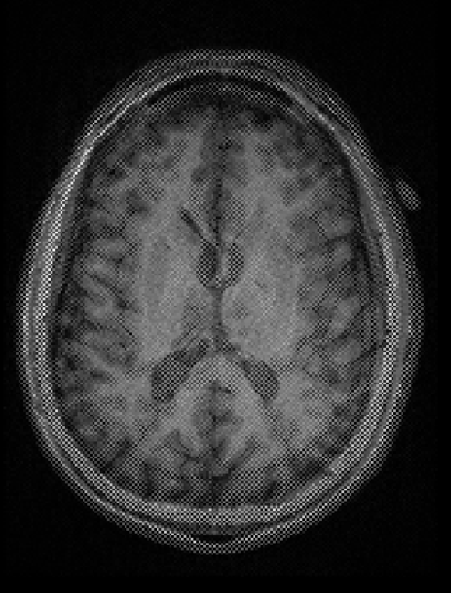
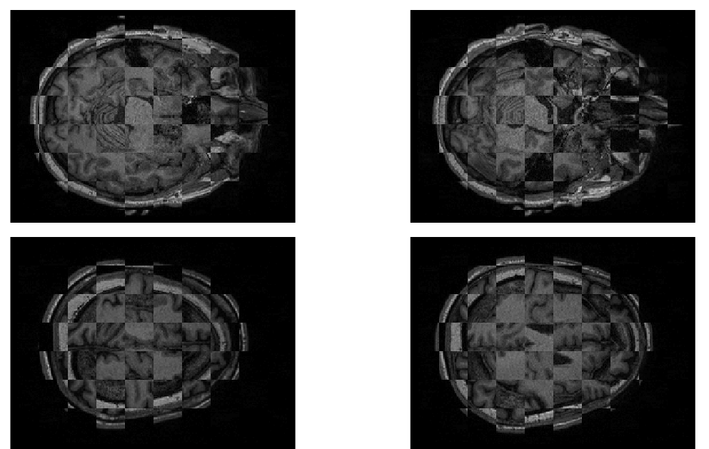
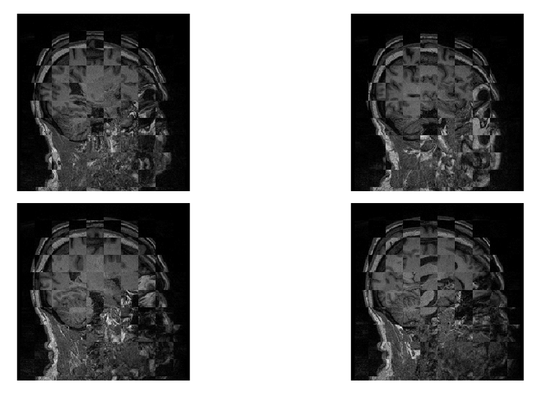
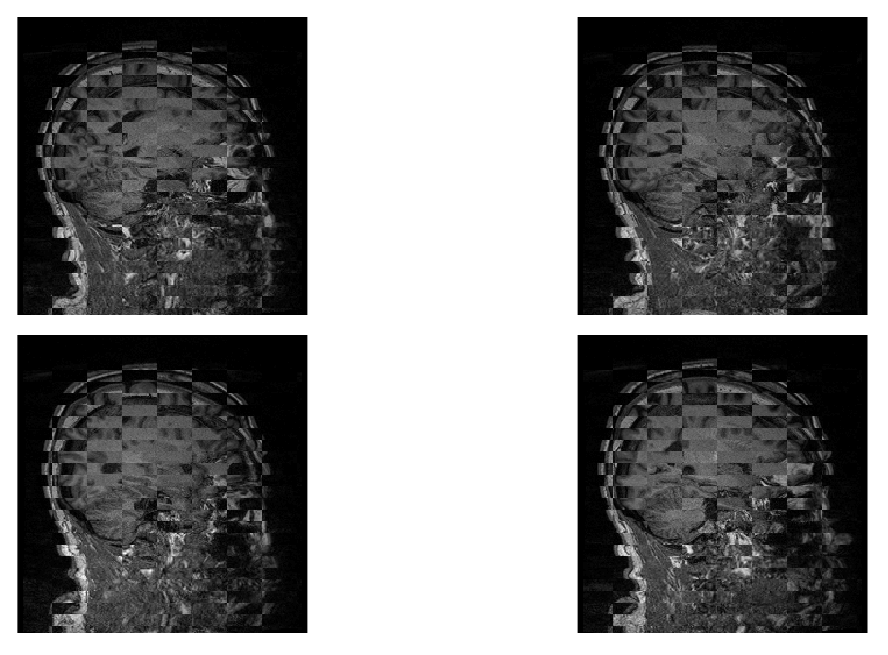

# mrivis

`mrivis` offers
- tools for comparison of spatial similarity of 3d MRI scans (T1, T2, PET etc) using checkerboard plots and other comparison methods (see below).
- classes to develop customizable collages of 3d images - [demo](https://nbviewer.jupyter.org/github/raamana/mrivis/blob/master/docs/example_notebooks/mrivis_demo_Collage_SlicePicker_classes.ipynb)


## Installation

```bash
pip install -U mrivis
```

## Usage:

Note: this package is in ACTIVE development.
Expect minor bugs, along frequent fixes/changes.


```python
from mrivis import checkerboard, voxelwise_diff, color_mix

path1 = '/Users/Reddy/Desktop/image.nii'
path2 = '/Users/Reddy/Desktop/another.nii'

checkerboard(path1, path2, patch_size=5) # square patches

checkerboard(path1, path2, rescale_method=(0, 256) )

checkerboard(path1, path2, patch_size=10,
             num_rows=1, num_cols=3) # 1 row per dimension, with 3 columns

checkerboard(path1, path2, patch_size=[10, 20], # rectangular patches
             num_rows=2, # 2 rows per dimension (6 rows in total)
             num_cols=5) # 5 panels per row

voxelwise_diff(path1, path2)
voxelwise_diff(path1, path2, abs_value=False)

color_mix(path1, path2, alpha_channels=(1, 1))
color_mix(path1, path2, alpha_channels=(0.7, 1))

```

## Various options available

Download this image to get a better look at the differences:


## Comparing two BOLD images


## Sample outputs for checkerboard plots

When the two scans are mismatched:


When the mismatch is low (here a smoothed image is comapred to its original),
you can see the differences in intensity (due to smoothing),
but you can also see that they are both spatially aligned accurately:


With really low patch-sizes (e.g. 1, which is voxel-wise alternation), you can see the alignment even better:



When there is mismatch, you can clearly see it (patch size 15 voxels square):


Let's make the patches a bit bigger (patch size 25 voxels square):




Let's make the patches a even bigger (50 voxels square):


Let's use a **rectangular** patch (10 voxels high and 30 voxels wide):




If they were identical (no mismatch at all), you won't see any edges or borders:


Full layout with 6x6 pangels can be seen in [this folder](docs/comprehensive).

## More example outputs

Many more example outputs, for different combinations of parameters, can be seen in this [example outputs folder in docs](docs/example_outputs).


