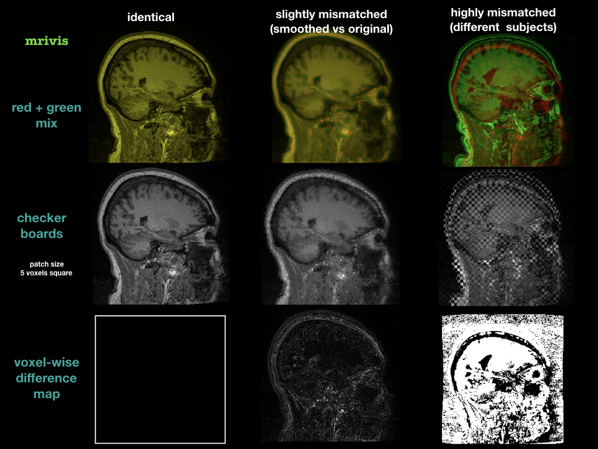

------
mrivis
------

.. image:: http://joss.theoj.org/papers/10.21105/joss.00897/status.svg
   :target: https://doi.org/10.21105/joss.00897

.. image:: https://img.shields.io/pypi/v/mrivis.svg

.. image:: https://api.codacy.com/project/badge/Grade/370b1b78383b40b99eb15ae0490cfbdb
    :target: https://www.codacy.com/app/raamana/mrivis

.. image:: https://img.shields.io/badge/say-thanks-ff69b4.svg
        :target: https://saythanks.io/to/raamana

----------

`mrivis` offers intuitive high-level classes for visualization of medical imaging data including:

- advanced classes to easily develop customizable visualizations of 3D and 4D images, such as `Carpet()`, `SlicePicker()`, `Collage()` and the like
- tools for comparison of spatial alignment of two 3D MRI scans (T1, T2, PET etc) using checkerboard plots and other comparison methods
- additional helper, convenience and utility scripts related to visualization

Full documentation for both visualization classes and alignment check tools is available at

https://raamana.github.io/mrivis/readme.html

----------

A sample gallery of different ways to check alignment (just one of the many other features in `mrivis`) is shown below:

----------

Full documentation https://raamana.github.io/mrivis/readme.html

Executable and interactive demo for the visualization classes:

.. image:: https://mybinder.org/badge.svg
    :target: https://mybinder.org/v2/gh/raamana/mrivis/master?filepath=docs%2Fexample_notebooks%2Fmrivis_demo_vis_classes.ipynb

**Installation**

.. code-block:: console

    $ pip install mrivis

If you would like to use the export to GIF from ``SlicePicker``, then install the ``imageio`` package as well via ``pip install imageio``

